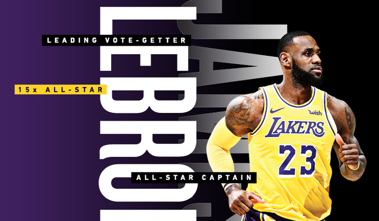

## markdown
#### challenge for markdown challenge
## Page 1


<https://www.google.com>


1. LeBron's ppg is 27.3.
2. LeBron's Salary is 35millions.
3. LeBron is the best basketball player.


* **number 1**
+ ~~number 2~~
- *number 3*


| Name        |   Points per game       |   Salary     |
| ------------- |:-------------:| -----:|
|Lebron James      | 27.3 | $35millions |
|Stephen Curry      |  29.3     |   $37millions |
| James Harden      | 36.3      |    $30millions |


> **LeBron James** is one of the best basketball player in the history


```javascript
var s = "LeBron James is the best player";
alert(s);
```


one

---

two

***

three

___



[second page](second.md)
